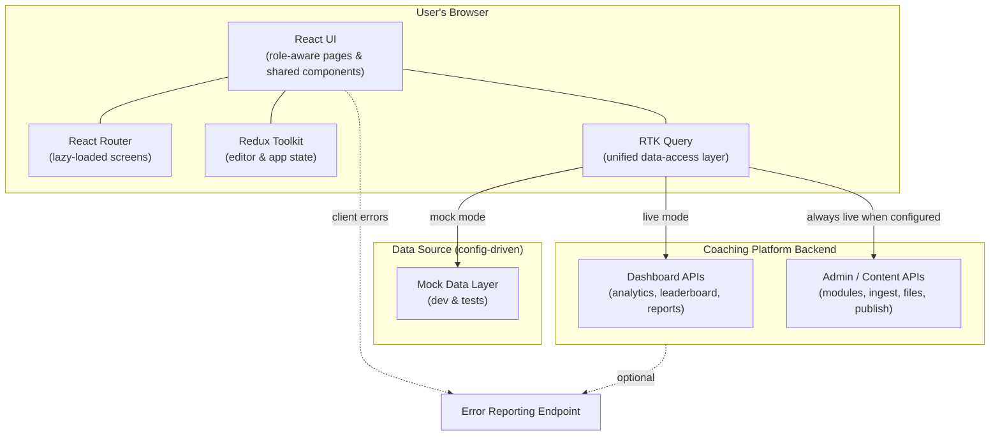
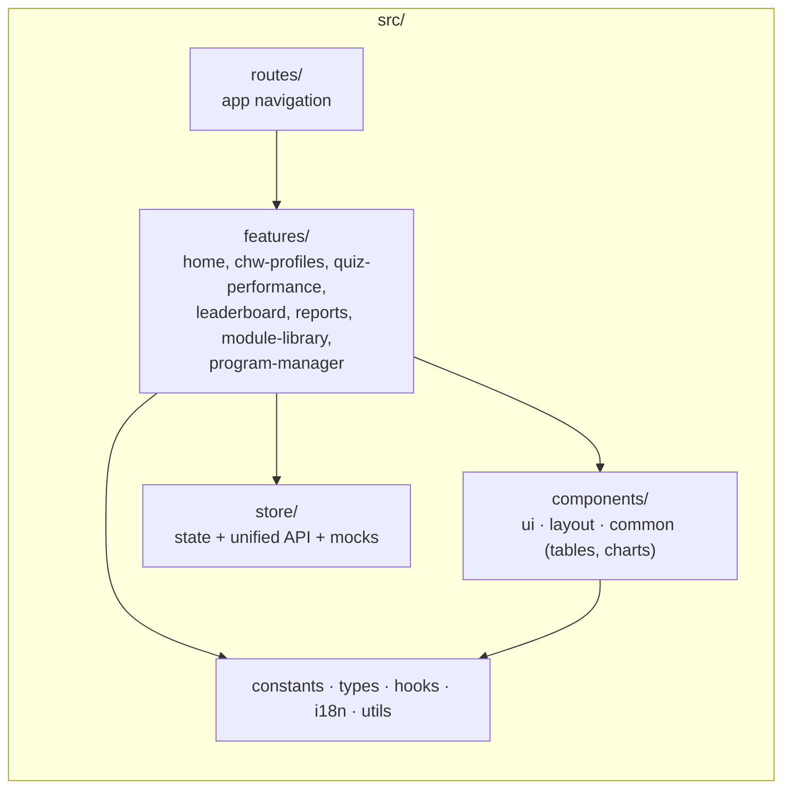
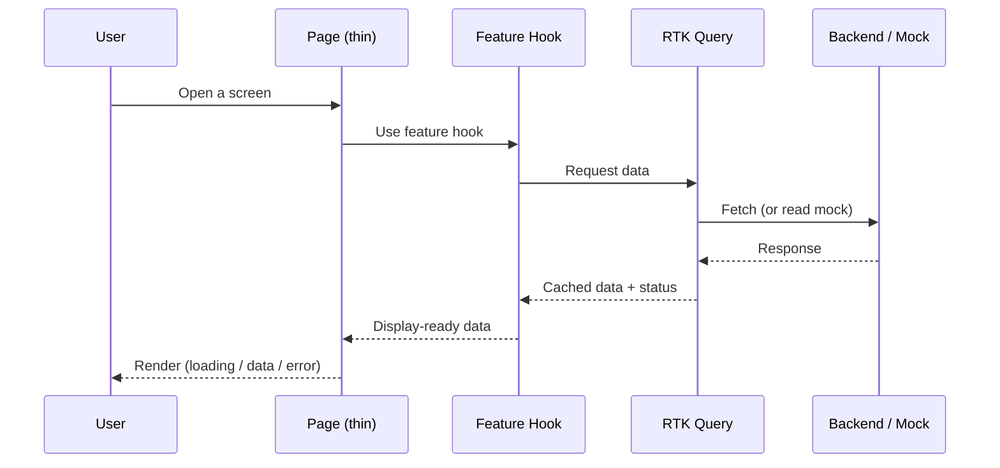
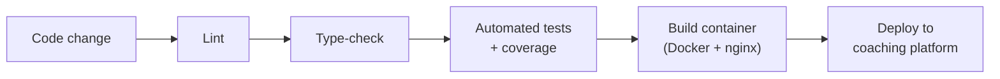

# Micro-Learning Analytics Dashboard — Solution Overview

**Prepared for:** Client Stakeholders
**Product:** Medtronic AI Coaching — UC-3 *Measure*
**Document type:** Services, features, and architecture overview

---

## 1. Introduction

The Micro-Learning Analytics Dashboard is the web application that lets field
program teams **measure and act on learning outcomes** for Community Health
Workers (CHWs). It turns coaching and quiz activity into clear, role-specific
views so that the right person sees the right information:

- **Supervisors** track the CHWs they manage — progress, knowledge gaps,
  module uptake, and quiz performance.
- **Program Managers** get a program-wide view across all supervisors and
  CHWs, and own the **content lifecycle**: creating modules from source
  documents, reviewing them, and publishing them to the coaching platform.

The dashboard is a single-page web application that connects to the coaching
platform's backend services for live data and content operations. It is built
for clarity, accessibility, and easy maintenance, and ships through an
automated build-and-deploy pipeline.

---

## 2. Services & Technology Stack

This section summarizes the services and libraries the solution relies on,
grouped by responsibility. Each choice favors stability, strong typing, and
low long-term maintenance cost.

### 2.1 Core application

| Area | Service / Library | Why it is used |
|------|-------------------|----------------|
| UI framework | **React 18** | Industry-standard component model for interactive dashboards |
| Language | **TypeScript (strict)** | Compile-time safety; all data shapes are explicitly typed |
| Build & dev server | **Vite 5** | Fast local development and optimized production builds |
| Styling | **Tailwind CSS** | Consistent design tokens and a maintainable styling system |
| Routing | **React Router v6** | Page navigation with lazy-loaded screens for fast first load |

### 2.2 Data & state management

| Area | Service / Library | Why it is used |
|------|-------------------|----------------|
| App state | **Redux Toolkit** | Predictable, centralized state for editor workflows |
| Server data | **RTK Query** | Single, cached data-access layer for all backend calls |
| HTTP transport | **Fetch (via RTK Query)** | Unified request handling, caching, and loading/error states |

All backend communication flows through **one unified API layer**. This means a
single, consistent place controls how the app talks to the backend, including
caching, request headers, and error handling.

### 2.3 Content authoring (module creation & review)

| Area | Service / Library | Why it is used |
|------|-------------------|----------------|
| Rich-text editing | **TipTap** | Editing lesson and quiz content with formatting |
| Editor UI shell | **Mantine** | Toolbar and editor chrome around TipTap |
| Drag-and-drop ordering | **dnd-kit** | Reordering lessons and quiz items intuitively |

### 2.4 Visualization & localization

| Area | Service / Library | Why it is used |
|------|-------------------|----------------|
| Charts | **Recharts** | Reusable bar, line, and pie charts for analytics |
| Internationalization | **i18next** | English and Bangla (বাংলা) language support |

### 2.5 Quality, tooling & delivery

| Area | Service / Library | Why it is used |
|------|-------------------|----------------|
| Testing | **Vitest + Testing Library** | Behavior-focused automated tests |
| Linting & formatting | **ESLint + Prettier** | Enforced, consistent code style |
| Pre-commit checks | **Husky + lint-staged** | Quality gate before code is committed |
| Containerization | **Docker + nginx** | Reproducible production hosting |
| CI/CD | **GitLab CI** | Automated lint, type-check, test, build, and deploy |

> **Note on data sources:** The app can run against **live backend APIs** or a
> built-in **mock data layer**. Mock mode is used for local development and
> automated testing so the UI can be developed and verified independently of
> backend availability. Content/admin operations always use the real backend
> when configured.

---

## 3. Feature Overview

The dashboard adapts to the signed-in role. The table below lists the major
capability areas, followed by a short description of each.

| Capability | Supervisor | Program Manager |
|------------|:----------:|:---------------:|
| Home dashboard | ✅ Supervisor view | ✅ Program-wide view |
| People management | CHW profiles | Supervisors + CHW roster |
| Quiz performance analytics | ✅ | ✅ |
| Leaderboard / rankings | Leaderboard | Rankings |
| Reports | ✅ | ✅ |
| Module library | View & review | Full lifecycle |
| Module creation from documents | — | ✅ |
| Escalations | — | ✅ |

### 3.1 Home dashboard

A role-aware landing page. Supervisors see KPIs, performance insights, flagged
CHWs, a leaderboard snapshot, a performance matrix, and module progress.
Program Managers see a program-wide overview with KPIs, insights, and
supervisor summary cards.

### 3.2 CHW profiles & roster

- **Supervisors** browse a searchable list of their CHWs and open a detailed
  profile showing metrics, per-module progress, and quiz history.
- **Program Managers** view a program-wide CHW roster across all supervisors.

### 3.3 Quiz performance analytics

A dedicated analytics screen with three perspectives — **by module**,
**by CHW**, and **by question** — to pinpoint where learners struggle and which
content needs improvement.

### 3.4 Leaderboard & rankings

Supervisors see a CHW leaderboard (points, pass rate, trend) with quick links
into individual profiles. Program Managers see supervisor-level rankings.

### 3.5 Reports

A reports hub with summary statistics and downloadable/standard report listings
for sharing program performance outside the dashboard.

### 3.6 Module library & content lifecycle

The richest area of the product, primarily owned by Program Managers:

1. **Ingest documents** — upload source documents; the system processes them
   into draft learning modules, with live status while processing runs.
2. **Create & edit** — refine generated **lessons** (rich text) and **quiz**
   questions/options, including reordering content via drag-and-drop.
3. **Review** — a guided, multi-step review flow (details → lessons → quiz →
   review/publish) with clinical review and unsaved-changes safeguards.
4. **Publish & assign** — publish approved modules to the coaching platform and
   confirm assignment.

### 3.7 Program management (Program Manager only)

Program-wide oversight tools: **supervisor list and drill-down**,
**CHW roster**, **escalations queue**, and **rankings**, plus the
**course/module creation** pipeline described above.

### 3.8 Cross-cutting capabilities

- **Role-aware navigation** — the sidebar, available screens, and theme adapt
  to the active role.
- **Bilingual UI** — English and Bangla support via i18next.
- **Accessibility** — shared UI components and charts include required labels
  and roles.
- **Resilience** — loading, empty, and error states are handled consistently,
  with client-side error reporting to an optional monitoring endpoint.

---

## 4. Architecture

### 4.1 High-level architecture

The dashboard is a browser-based single-page application. It renders the UI,
manages local editing state, and communicates with backend services through one
unified data-access layer. In non-production environments it can substitute a
mock data layer for the backend.

**How to read this:**

- The **React UI** is the only thing the user interacts with.
- **Routing** loads each screen on demand for fast startup.
- **Redux Toolkit** holds in-progress editing state (e.g. module review).
- **RTK Query** is the single gateway to data — it caches results and exposes
  loading/error states to the UI.
- Depending on configuration, RTK Query talks to the **mock layer** (local
  development and tests) or the **live backend APIs**. Content/admin
  operations always use the live backend when an API URL is configured.

### 4.2 Code structure (feature-first)

The codebase is organized **by feature/domain**, not by technical layer. Each
feature owns its pages, data access, hooks, and tests, which keeps related code
together and easy to evolve.

### 4.3 Typical request flow

The same predictable pattern is used everywhere data is shown or saved:

**Key principles**

- **Pages stay thin** — they render UI; logic lives in typed hooks and
  services.
- **One data layer** — all backend access goes through RTK Query, giving
  consistent caching, error handling, and request headers.
- **Strict typing end-to-end** — backend responses are modeled with explicit
  types, reducing runtime surprises.

---

## 5. Deployment & Quality

### 5.1 Environments and configuration

The application is configured through environment variables set at build time,
most importantly the **backend API base URL** and **mock-mode flags**.
Production builds require a real backend URL with mock mode disabled.

### 5.2 Build, test, and deploy pipeline

Every change runs through an automated pipeline before reaching an environment:

### 5.3 Quality commitments

- **Automated tests** with enforced coverage thresholds on shared UI and core
  modules.
- **Type-checking and linting** gate every commit and CI run.
- **Consistent formatting** and documented team conventions keep the codebase
  maintainable as the team grows.
- **Accessibility and internationalization** are first-class concerns.

---

## 6. Summary

The Micro-Learning Analytics Dashboard delivers role-specific insight into CHW
learning and a complete, guided **content lifecycle** for program managers — all
on a modern, strongly-typed React stack. A single unified data layer, a
feature-first code structure, and an automated delivery pipeline make the
solution **reliable to operate** and **straightforward to extend** as program
needs evolve.

---

*For deeper technical detail, see the project `README.md`, the UI component
system specification (`docs/ui-component-system-spec.md`), and the module
reordering design notes (`docs/module-item-reordering/`).*
