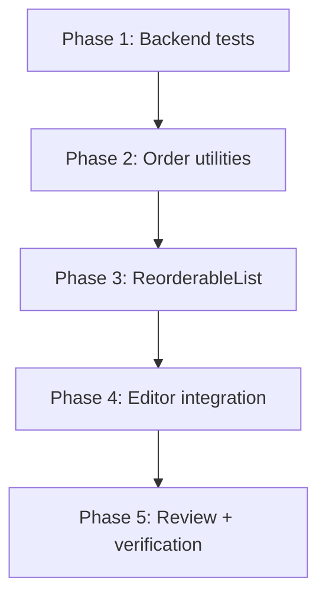
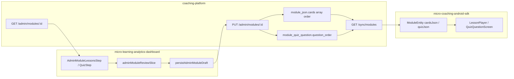

# Module Item Reordering — Implementation Plan

**User story:** As a Program Manager, I want to rearrange cards and quizzes within a training module so that I can organize the learning flow in the most effective sequence for learners.

**Scope:** Within-type ordering only — reorder cards among themselves and quiz questions among themselves. Cards always precede the quiz block for CHW learners. No unified interleaved `module_items[]` schema.

**Repos involved:**

| Repo | Role |
|------|------|
| [micro-learning-analytics-dashboard](../../) | Program Manager admin UI (module review editor) |
| [coaching-platform](../../../android%20work/coaching-platform/) | Backend API — module storage, admin PUT/GET, CHW sync |
| [micro-coaching-android-sdk](../../../android%20work/micro-coaching-android-sdk/) | Android SDK — CHW learner consumes synced content (**no changes required**) |

---

## Phased execution

Implement this feature **one phase at a time**. Each phase has its own doc with prerequisites, tasks, files to touch, and a done checklist. Do not start a later phase until the previous phase’s checklist is complete.

| Phase | Doc | Repo | Summary |
|-------|-----|------|---------|
| **1** | [phase-1-backend-verification-tests.md](./phase-1-backend-verification-tests.md) | coaching-platform | Lock in backend ordering contract with integration tests |
| **2** | [phase-2-frontend-order-utilities.md](./phase-2-frontend-order-utilities.md) | micro-learning-analytics-dashboard | Pure reorder utilities, save payload prep, API normalization |
| **3** | [phase-3-reorderable-list-component.md](./phase-3-reorderable-list-component.md) | micro-learning-analytics-dashboard | Shared DnD + Move Up/Down UI component |
| **4** | [phase-4-editor-step-integration.md](./phase-4-editor-step-integration.md) | micro-learning-analytics-dashboard | Wire reorder into Lessons and Quiz editor steps |
| **5** | [phase-5-review-persist-and-verification.md](./phase-5-review-persist-and-verification.md) | micro-learning-analytics-dashboard + coaching-platform | Review UI, persist wiring, tests, acceptance verification |

Phase 1 can run in parallel with Phase 2 if backend and frontend are worked on by different people, but **Phase 2 should not merge until Phase 1 tests pass** (or are explicitly waived with documented risk).

---

## Architecture summary

### Order source of truth

| Content | Storage | Authoritative order | Sorted on read? |
|---------|---------|---------------------|-----------------|
| **Cards** | `module.module_json` → `cards[]` JSONB | **Array index** | No — stored array order returned as-is |
| **Quiz** | `module_quiz_question` table | **`question_order`** column | Yes — `ORDER BY question_order ASC NULLS LAST` |

**Important:** The frontend type `card_order?: number` is **not** backend-authoritative. The ingest pipeline’s `_normalise_card` strips it. Reordering cards means reordering the `cards[]` array on PUT.

### Save / publish (unchanged contract)

- **Save draft:** `PUT /admin/modules/{id}` with `module_json: { cards, quiz }`
- **Publish:** Save if dirty → `POST /admin/modules/{id}/clinically-reviewed`
- **No new endpoints, no DB migrations**

---

## Core implementation principles

1. **Cards:** reorder by splicing the array — do not write `card_order` fields.
2. **Quiz:** renumber `question_order` to contiguous `1..n` on every reorder or delete.
3. **Card selection:** track by **index** (cards have no stable backend IDs per version).
4. **UI:** drag-and-drop via `@dnd-kit` with Move Up / Move Down as fallback.
5. **Save:** `prepareModuleJsonForSave()` normalizes payload before every PUT.

---

## Database / schema changes

**None.**

---

## Out of scope

- Legacy `/courses/new/*` course wizard
- Unified interleaved ordering (Card → Quiz → Card in one list)
- New reorder API endpoints
- Alembic migrations or backfill scripts
- Android SDK changes

---

## Acceptance criteria (full verification in Phase 5)

| # | Criterion |
|---|-----------|
| 1 | Reorder cards and quiz questions within a module |
| 2 | Drag-and-drop preferred; Move Up/Down as fallback |
| 3 | Updated order reflected immediately in editor UI |
| 4 | Rearrange multiple times before saving |
| 5 | Save as Draft persists order |
| 6 | Publish persists order |
| 7 | CHWs see configured order (via sync + SDK array order) |
| 8 | Reorder does not modify card/quiz content or learner progress |
| 9 | Latest saved order persists across sessions |
| 10 | Error handling when reorder persistence fails |

---

## Key file index

### Frontend (micro-learning-analytics-dashboard)

| Purpose | Path |
|---------|------|
| Card type | `src/features/module-library/types/adminModule.types.ts` |
| Quiz type + API | `src/features/module-library/api/adminModulesApi.ts` |
| Review state | `src/features/module-library/store/adminModuleReviewSlice.ts` |
| Save | `src/features/module-library/utils/persistAdminModuleDraft.ts` |
| Lessons UI | `src/features/module-library/pages/admin-module-review/AdminModuleLessonsStep.tsx` |
| Quiz UI | `src/features/module-library/pages/admin-module-review/AdminModuleQuizStep.tsx` |

### Backend (coaching-platform)

| Purpose | Path |
|---------|------|
| Admin API | `services/platform/src/platform_service/api/admin_modules.py` |
| Module repo | `services/platform/src/platform_service/db/repositories/module_repository.py` |
| Sync service | `services/platform/src/platform_service/services/sync_service.py` |
| Admin tests | `tests/api/test_admin_modules.py` |
