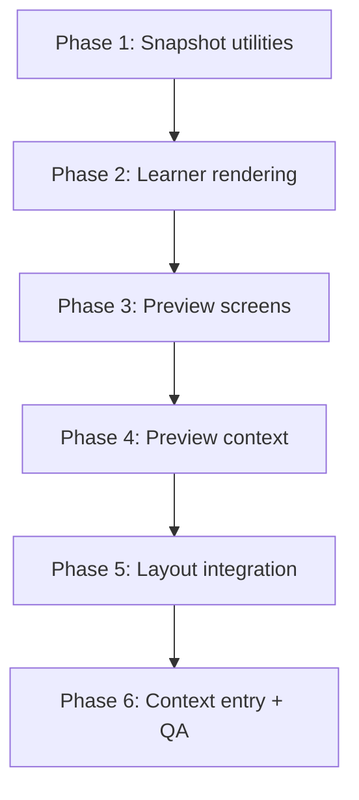
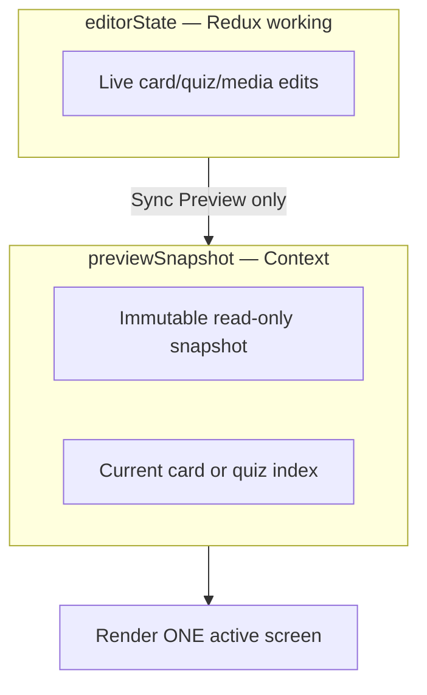
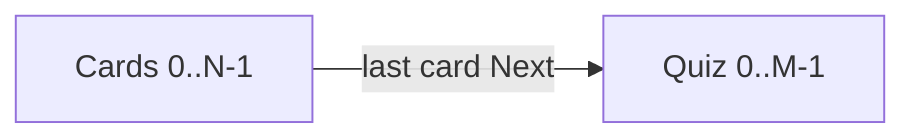

# Module Preview — Implementation Plan

**User story:** As a Program Manager, I want to sync my latest edits and preview **learning cards and quiz questions** so that I can validate the full learner experience before publishing.

**Scope:** Client-side, snapshot-based mobile preview inside the Module Editor. Covers **both lesson cards and quizzes** in one continuous learner journey. Mirrors the Android CHW flow (all cards, then all quiz questions), including ordering, rich content, quiz answer reveal, and read-only navigation. **No backend, database, or Android SDK changes.**

---

## What preview covers

Preview is a **full module learner journey**, not cards-only.

### Learning card preview

- Card-by-card navigation with "Learning X of N" header
- Title + rich body (`RichBlock[]`) — paragraphs, headings, lists, images, video placeholders
- Same array order as `module_json.cards[]`
- Context-aware entry from **Lessons** step (opens at selected card)

### Quiz preview

- Question-by-question navigation after all cards ("Question X of N")
- Single-select multiple choice (matches Android — no multi-select or free text)
- **Case setup** clinical scenario box when `case_setup_bn` is set
- Tap answer → lock → reveal correct/wrong styling → **explanation** (read-only validation flow)
- A/B/C/D answer badges (Android `AnswerCard` parity)
- Same order as `question_order` via `sortQuizItems()`
- Context-aware entry from **Quiz** step (opens at focused question)
- Quiz reorder: old order until Sync Preview, new order after sync

### Shared behavior (cards + quiz)

- **Sync Preview** refreshes both cards and quiz from editor `working` state
- Editing either cards or quiz does **not** auto-update preview
- **Full module preview:** Previous / Next through entire flow without publishing
- One active screen at a time (card **or** quiz question)

**Repos involved:**

| Repo | Role |
|------|------|
| [micro-learning-analytics-dashboard](../../) | Program Manager admin UI — preview UI, snapshot generation, state |
| [coaching-platform](../../../android%20work/coaching-platform/) | Backend — existing `GET/PUT /admin/modules/:id`, presigned file URLs (**read-only for this feature**) |
| [micro-coaching-android-sdk](../../../android%20work/micro-coaching-android-sdk/) | Android SDK — **behavioral reference** for rendering and navigation (**no changes required**) |

---

## Phased execution

Implement this feature **one phase at a time**. Each phase has its own doc with prerequisites, tasks, files to touch, verification commands, and a done checklist. Do not start a later phase until the previous phase’s checklist is complete.

| Phase | Doc | Summary |
|-------|-----|---------|
| **1** | [phase-1-snapshot-utilities-and-types.md](./phase-1-snapshot-utilities-and-types.md) | Preview types, snapshot generator, navigation helpers, answer-card state logic + unit tests |
| **2** | [phase-2-learner-rendering-components.md](./phase-2-learner-rendering-components.md) | Read-only `LearnerRichCardBody`, image/video/audio blocks (no TipTap editor) |
| **3** | [phase-3-preview-screens-and-navigation.md](./phase-3-preview-screens-and-navigation.md) | Mobile frame, lesson card screen, quiz screen, prev/next navigator |
| **4** | [phase-4-preview-context-and-state.md](./phase-4-preview-context-and-state.md) | `ModulePreviewContext`, sync/open preview, dual-state isolation |
| **5** | [phase-5-layout-integration.md](./phase-5-layout-integration.md) | Preview panel/modal in `AdminModuleReviewLayout`, Sync Preview button |
| **6** | [phase-6-context-aware-entry-and-verification.md](./phase-6-context-aware-entry-and-verification.md) | Lessons/quiz step wiring, integration tests, full acceptance verification |

Phases 1–3 are pure frontend logic/components with **no editor wiring** — safe to build and test in isolation. Phase 4 connects context to Redux read-only. Phases 5–6 integrate into the live editor flow.

---

## Architecture summary

### Dual-state model

| State | Location | Updates when |
|-------|----------|--------------|
| **editorState** | Redux `working` / `baseline` in `adminModuleReviewSlice` | Every edit (unchanged) |
| **previewSnapshot** | `ModulePreviewContext` | Module hydrate (seed from `baseline` once) + explicit **Sync Preview** click |

**Why context, not Redux:** Preview must never subscribe editor components to preview re-renders (or vice versa). Keystrokes update `working` only; preview stays frozen until sync.

### Android learner flow (preview must match)

- **Card order:** `module_json.cards[]` array index
- **Quiz order:** `question_order ASC` via `sortQuizItems()`
- **Language:** BN-primary (`title_bn`, `body_bn`, `question_bn`, `options_bn`)
- **Videos:** thumbnail/placeholder only — **no playback** in preview
- **Read-only:** no save, no edit, no telemetry

See [architecture-reference.md](./architecture-reference.md) for detailed investigation findings across all three repos.

---

## Core implementation principles

1. **Sync Preview only** — never auto-refresh preview on keystroke or reorder.
2. **Render one screen** — mount exactly one card OR one quiz question at a time.
3. **Clone once per sync** — `generateModulePreviewSnapshot()` deep-copies on sync; navigation indexes into frozen arrays.
4. **Lazy media** — presign URLs only for the active screen’s image/video blocks via `usePresignedFileUrl`.
5. **Preserve position** — on re-sync, keep `{ phase, index }` and clamp if items were removed.
6. **Do not reuse TipTap editor** — build dedicated read-only learner renderers.
7. **Port Android behavior, not Kotlin** — match contracts from Android parser tests.

---

## Backend / database changes

**None.**

Preview reads editor `working` state client-side. Media uses existing `GET /admin/v3/files/presigned-url`. No new endpoints, migrations, or contracts.

---

## Out of scope

- Video playback in preview
- Android SDK changes
- New backend preview/draft endpoints
- Source document preview inside learner preview (authoring-only side panel stays separate)
- Refresher “question-first” / “cards-first” alternate flows
- Learner progress, telemetry, XP, TTS
- Legacy `/courses/new/*` course wizard
- Auto-sync preview on save or publish

---

## Acceptance criteria (full verification in Phase 6)

| # | Criterion |
|---|-----------|
| 1 | Mobile phone style preview container |
| 2 | Same content ordering as learner app (cards array index, quiz `question_order`) |
| 3 | Same card rendering behavior (title + rich body) |
| 4 | Same quiz rendering (single-select MCQ, answer reveal, explanation) |
| 5 | Same media rendering — images load; videos show placeholder; no video playback |
| 6 | Same navigation flow — all cards, then all quiz questions |
| 7 | Read-only — no edit/save from preview |
| 8 | Preview shows last synced version while editing |
| 9 | Sync Preview refreshes snapshot from current editor state |
| 10 | Re-sync preserves preview position when possible |
| 11 | Context-aware: editing Card N opens preview at Card N |
| 12 | Context-aware: editing Quiz N opens preview at Quiz N |
| 13 | Full module navigation via Previous / Next |
| 14 | Reorder: old order before sync, new order after sync |
| 15 | Sync failure: error message, retry, editor unchanged, preview not corrupted |
| 16 | Performance: editor stays responsive with large modules |

---

## Key file index

### New (by end of Phase 6)

| Purpose | Path |
|---------|------|
| Types | `src/features/module-library/types/modulePreview.types.ts` |
| Snapshot | `src/features/module-library/utils/generateModulePreviewSnapshot.ts` |
| Navigation | `src/features/module-library/utils/modulePreviewNavigation.ts` |
| Quiz state | `src/features/module-library/utils/previewAnswerCardState.ts` |
| Context | `src/features/module-library/context/ModulePreviewContext.tsx` |
| Hook | `src/features/module-library/hooks/useModulePreview.ts` |
| Preview UI | `src/features/module-library/components/module-preview/*` |
| Quiz preview screen | `.../module-preview/QuizQuestionPreviewScreen.tsx` |
| Quiz answer UI | `.../module-preview/PreviewAnswerCard.tsx` |
| Quiz state logic | `.../utils/previewAnswerCardState.ts` |

### Existing (read-only dependencies)

| Purpose | Path |
|---------|------|
| Editor state | `src/features/module-library/store/adminModuleReviewSlice.ts` |
| Card normalization | `src/features/module-library/utils/cardBody.ts` |
| Quiz ordering | `src/features/module-library/utils/adminModuleQuizUtils.ts` |
| Save ordering | `src/features/module-library/utils/prepareModuleJsonForSave.ts` |
| Presigned URLs | `src/features/module-library/hooks/usePresignedFileUrl.ts` |
| Rich block types | `src/features/program-manager/types/programManager.types.ts` |
| Layout | `src/features/module-library/layout/AdminModuleReviewLayout.tsx` |
| Lessons step | `src/features/module-library/pages/admin-module-review/AdminModuleLessonsStep.tsx` |
| Quiz step | `src/features/module-library/pages/admin-module-review/AdminModuleQuizStep.tsx` |

### Android reference (behavioral spec)

| Purpose | Path |
|---------|------|
| Card player | `micro-coaching-android-sdk/.../ui/learn/LessonPlayerScreen.kt` |
| Quiz screen | `micro-coaching-android-sdk/.../ui/quiz/QuizQuestionScreen.kt` |
| Rich body | `micro-coaching-android-sdk/.../ui/richtext/RichCardBody.kt` |
| Card parser tests | `micro-coaching-android-sdk/.../LessonCardsJsonParserTest.kt` |
| Quiz parser tests | `micro-coaching-android-sdk/.../QuizJsonParserTest.kt` |
